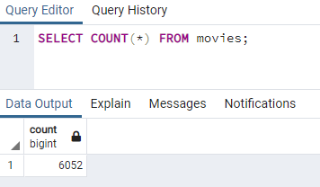
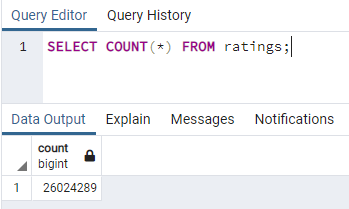

# Movies-ETL

## Purpose:
In this week's challenge, the goal was to learn ETL (Extract, Transform, and Load). The goal was to take existing data from the internet, clean the data fitting for a table, and then loading that data into a database.

1. **Extract**: We downloaded Wikipedia data (in JSON file format) and extracted Kaggle data from MovieLens. Well pulled in the zip file from the website, extracted the files we needed from the folder and decompressed it into CSV files.
2. **Transform**: There are many different types of cleaning strategies. Here we applied list comprehensions to filter data, created functions to iterate through the code, and applied new concepts like `lambda functions` and `regular expressions`. In addition, the aim was to select our desired columns and updating the data (without destroying our original). As we selected our columns and updated the header names, we needed to ensure the data in our rows were clean. Hence, we dropped rows where nulls existed and reformatted the datatypes to create consistency. After parsing and removing bad data from both the Wikipedia and Kaggle files, we needed to merge the metadatas. Moving through the exercise, we determined which source to keep depending on volume and accuracy of the data. So one by one, we compared overlapping columns and used scatterplots to decide if Wikipedia or Kaggle was the source of truth. In addition, we considered the other source to be supplemental if it didn't exist in the other. Moreover, once complete - we had a final table to load.
3. **Load**: The final step consisted of loading the data into a SQL database. Using PostgreSQL and pgAdmin, we created a new database (movie_data) to store the tables we made. Here is where we imported the modules to create our database engine. We should see when the code is ran, it will create a new table in our newly created DB in pgAdmin. With success, it's now available to query and create analysis.

## Results:
After running the queries, you arrive at the following results:  
 

## Challenges:

*I ran into a few hiccups related to github using gitbash and noting some of my solutions:* 
1. Pushing large files to github: use git lfs.
2. How to kill a running process in gitbash: Use Ctrl + C
3. How to uncommit a file: git reset --soft HEAD^ 

*Dealing with Exceptions and try-except:* 
>#for the try-except block 
>import sys 
>except: 
>         e = sys.exc_info()[0] 
>         print(f'Error: {e}') 
>Source: https://wiki.python.org/moin/HandlingExceptions

*Other roadblocks:* 
- `from sqlalchemy import create_engine`: wouldn't work with pythondata (for Anaconda) - will work for anaconda3(base); consider installing in other terminals?
- importing from config was not bringing in the desired variables. As a solution, a simple refresh will suffice. Here I did an `import *` instead of a variable as the asterik is
a catch-all for all the variables noted. Hence, I created another variable related to the directory name. Hence by bring everything in with the ( * ), it made it easier to call throughout the code. 
 
 Overall, there was a lot to digest this week, but taking away some important concepts that will show up in the future.

